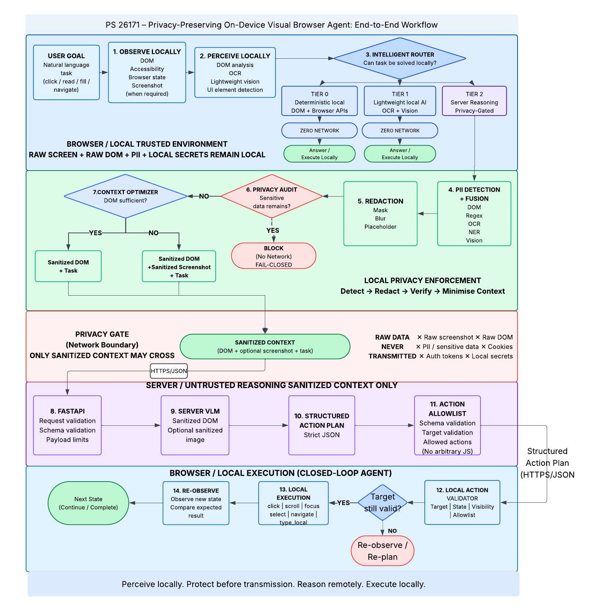

# Privacy-Preserving On-Device Visual Browser Agent

> **Perceive locally. Protect before transmission. Reason remotely only when necessary. Execute locally.**

A privacy-preserving browser agent that combines deterministic browser automation, local vision AI, and privacy-gated server-side reasoning.

The system follows a **local-first architecture**. Simple tasks are handled directly inside the browser, visually ambiguous tasks can use a lightweight local vision model, and complex tasks are escalated to a server-side VLM only after sensitive information has been detected and redacted locally.

## Architecture



## How It Works

```text
User Goal
   ↓
Observe Locally
   ↓
Perceive Locally
(DOM + OCR + Vision)
   ↓
Intelligent Router
   ├── Tier 0: Deterministic Local
   ├── Tier 1: Local Vision AI
   └── Tier 2: Server VLM
   ↓
Action Validation
   ↓
Local Execution
   ↓
Re-observe
   ↓
Continue / Complete
```

## Running Locally

### Backend

```bash
git clone <REPOSITORY_URL>
cd privacy-vision-agent

npm install

cd server
python -m venv .venv
source .venv/bin/activate
pip install -r requirements.txt
cd ..

VLM_PROVIDER=mock \
PYTHONPATH=server \
server/.venv/bin/uvicorn app.main:app \
--port 8000 \
--log-level warning
```

### Extension

1. Open `chrome://extensions/`
2. Enable **Developer mode**
3. Click **Load unpacked**
4. Select the `extension/` directory

## Running Tests

```bash
npm test
npm run test:local-vlm
npm run test:server
```

## Project Structure

```text
privacy-vision-agent/
├── extension/
│   ├── background/
│   ├── content/
│   ├── privacy/
│   ├── local_agent/
│   ├── shared/
│   └── manifest.json
├── server/
│   ├── app/
│   ├── tests/
│   └── requirements.txt
├── tests/
├── docs/
│   └── architecture.png
├── package.json
└── README.md
```

## Privacy Pipeline

The system ensures that sensitive information is processed locally before anything is sent to the server.

```text
Raw Browser Data
       ↓
Local PII Detection
       ↓
PII Fusion
       ↓
Local Redaction
       ↓
Privacy Audit
       ↓
Context Optimization
       ↓
Privacy Gate
       ↓
Sanitized Context
       ↓
Server VLM
```

The privacy gate is **fail-closed**: if sanitized context cannot be verified as safe, the request is not sent to the server.

## Local-First Execution

### Tier 0 — Deterministic Local

Handles straightforward browser actions such as:

- Clicking visible elements
- Focusing inputs
- Scrolling
- Opening visible links or menus
- Typing ordinary non-sensitive text
- Using locally stored secret references

No network request is required.

### Tier 1 — Local Vision AI

For visually ambiguous tasks, the browser can use a lightweight vision model running locally.

The local vision system uses:

- A local screenshot
- DOM metadata
- Element IDs
- Bounding boxes
- Optional OCR hints

The model identifies a visual target, which is then deterministically grounded to an existing browser element before execution.

### Tier 2 — Server VLM

Complex tasks that require broader reasoning can be escalated to the server.

Before escalation:

1. Sensitive information is detected locally.
2. Sensitive content is redacted.
3. The sanitized context is verified.
4. Only the sanitized context crosses the privacy boundary.

## Action Safety

All generated actions pass through validation before execution.

The action layer uses:

- Strict action schemas
- Allowlisted action types
- Target validation
- Element visibility checks
- Sensitive-input protection
- Bounded multi-step execution
- Re-observation after actions
- SPA/rerender-aware target resolution

The server never directly controls the browser. It produces an action plan that is validated and executed locally.

## Local Secret Handling

Sensitive values such as passwords and personal information are never included directly in model context or server requests.

Instead, the agent can reference locally stored secrets through an allowlisted reference.

```text
Model
  ↓
"fill password field with PASSWORD_REF"
  ↓
Local validation
  ↓
Local secret resolution
  ↓
Browser input
```

The actual secret remains inside the local browser environment.

## Technology Stack

- **Browser Extension:** Manifest V3
- **Frontend Runtime:** JavaScript
- **Local OCR:** Tesseract.js
- **Local Vision:** SmolVLM-256M-Instruct
- **Local Inference:** Transformers.js + ONNX Runtime Web
- **Backend:** FastAPI
- **Server VLM:** Provider abstraction with OpenAI support
- **Validation:** Pydantic
- **Testing:** Node.js tests + Python tests
- **Browser Automation:** Playwright

## Key Design Principles

- **Local-first:** Prefer local execution whenever possible.
- **Privacy by construction:** Sensitive information is processed before network transmission.
- **Fail-closed:** Failed privacy verification prevents server escalation.
- **Least context:** Send only the minimum information required for remote reasoning.
- **Structured actions:** Models never directly execute arbitrary browser code.
- **Local execution:** Browser actions are always validated and executed by the extension.
- **Re-observation:** The agent observes the browser again after actions to handle dynamic pages and state changes.

## Current Status

The project currently includes:

- Deterministic local browser agent
- Local OCR pipeline
- PII detection and fusion
- Local visual redaction
- Privacy verification and fail-closed privacy gate
- Context sanitization
- FastAPI backend
- Server-side VLM integration
- Local secret handling
- Local vision model
- Structured action validation
- Multi-step browser execution
- Automated evaluation and regression tests

## Limitations

The local vision model is intentionally lightweight. Complex reasoning, comparison, research, and other tasks outside the local execution capabilities may still require server-side reasoning.

Local vision performance also depends on the available browser inference backend. WebGPU is preferred when supported, with WASM available as a fallback.
